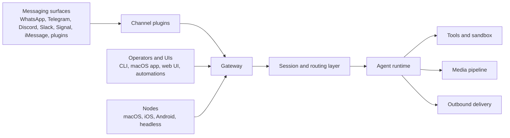

# Key technologies behind OpenClaw

OpenClaw is not mainly a model wrapper or a bot adapter. Its core design is a
**gateway-centered agent runtime** that lets one long-lived system connect chat
surfaces, agent sessions, tools, media, and remote nodes behind one control
plane.

This page explains the technical choices that matter most if you want to
understand how OpenClaw works internally.

## One picture first

## 1. Gateway first architecture

The first key idea is that OpenClaw treats the **Gateway** as the system of
record.

- One long-lived process owns messaging connections, the WebSocket control
  plane, health state, pairing state, and event fanout.
- Operator clients such as the CLI, web UI, and macOS app do not own the
  messaging sessions themselves. They connect to the same Gateway over
  WebSocket.
- Device nodes also connect to that same Gateway, but with `role: "node"` and
  explicit capabilities.

Why this matters:

- It avoids splitting state across multiple frontends.
- It keeps fragile channel sessions such as WhatsApp in one place.
- It makes remote operation practical because clients can connect through the
  same protocol over loopback, Tailscale, or SSH tunnels.

This is the main reason OpenClaw behaves more like an agent platform than a
collection of chat bots.

Related docs:

- [Gateway Architecture](/concepts/architecture)
- [Gateway Protocol](/gateway/protocol)
- [Remote Gateway](/gateway/remote)

## 2. Protocol as a typed contract

The second key idea is that the Gateway protocol is treated as a **real
product contract**, not an internal convenience API.

OpenClaw defines its protocol in TypeBox schemas and uses those schemas for:

- runtime validation with AJV
- JSON Schema generation
- generated client models such as the macOS Swift models

That means the same source of truth drives:

- what the server accepts
- what clients expect
- what gets documented and code generated

This reduces drift between the Gateway, desktop clients, web clients, and node
implementations.

A few details are especially important:

- The first frame must be `connect`.
- The wire format is stable: `req`, `res`, and `event`.
- Side-effecting requests use idempotency keys so retries are safe.
- Pairing and auth are part of the connection contract, not bolted on later.

This choice is why OpenClaw can support rich control flows such as `agent`,
`agent.wait`, node RPC, approvals, and presence updates without devolving into
ad hoc per-client behavior.

Related docs:

- [TypeBox](/concepts/typebox)
- [Gateway Protocol](/gateway/protocol)

## 3. Channel abstraction through plugins

The third key idea is that messaging integrations are modeled as **channel
plugins**, not one-off adapters.

A channel plugin can provide:

- config schema and onboarding
- pairing and security rules
- mention and group behavior
- outbound formatting and threading
- gateway methods
- channel-specific tools

The contract lives in the shared `ChannelPlugin` interface, while the runtime
registry keeps channel discovery lightweight. Bundled and external channels are
normalized through the same plugin registry rather than through special-case
branching all over the codebase.

The modern direction is also visible in the SDK surface:

- channel packages import `openclaw/plugin-sdk/*`
- runtime behavior is injected through `PluginRuntime`
- plugins are discouraged from importing `src/**` internals directly

Why this matters:

- New channels can reuse the same routing, tool policy, session, and onboarding
  concepts.
- Core behavior stays centralized instead of being reimplemented per channel.
- OpenClaw can evolve from "some built-in connectors" to a broader connector
  platform.

Related docs:

- [Channels](/channels/index)
- [Plugin SDK Refactor](/refactor/plugin-sdk)
- [Plugins](/tools/plugin)

## 4. Session centered message orchestration

The fourth key idea is that OpenClaw is **session-first**, not message-first.

Inbound messages do not go straight from connector to model. They pass through
a shared orchestration layer that resolves:

- which agent should receive the message
- which session key it belongs to
- whether the message is a duplicate
- whether it should be debounced
- whether it should be queued, steered, collected, or trigger a followup run

This is what lets OpenClaw work across direct chats, groups, threads, topics,
and multi-device control surfaces without collapsing into race conditions.

Important properties of this design:

- Sessions are owned by the Gateway, not by the client UI.
- History is persisted as transcripts plus session metadata on the gateway host.
- Queueing policy is explicit and configurable instead of being accidental.
- Group and thread surfaces can have different routing and gating while still
  sharing the same underlying agent runtime.

This session-centric model is one of the most important parts of the system,
because it turns a stream of chat events into coherent, resumable agent work.

Related docs:

- [Messages](/concepts/messages)
- [Session](/concepts/session)
- [Queue](/concepts/queue)
- [Multi-agent](/concepts/multi-agent)

## 5. Tool execution is a runtime boundary

The fifth key idea is that tool use is not treated as an unbounded side effect.
OpenClaw puts a **policy and execution boundary** between the model and the
host.

The relevant mechanisms include:

- tool allow and deny policy
- per-agent and per-provider tool restriction
- optional Docker sandboxing
- explicit elevated execution paths
- approval flows for sensitive exec requests
- HTTP `/tools/invoke` entrypoints that still pass through tool policy

This produces a layered model:

- the Gateway decides what is allowed
- the sandbox decides where it runs
- approvals decide when a human must intervene

That separation is more important than any single safety feature. It means
OpenClaw can expose a rich tool surface without pretending every tool has the
same trust level.

Related docs:

- [Sandboxing](/gateway/sandboxing)
- [Sandbox vs Tool Policy vs Elevated](/gateway/sandbox-vs-tool-policy-vs-elevated)
- [Tools Invoke HTTP API](/gateway/tools-invoke-http-api)

## 6. Media is part of the agent pipeline

The sixth key idea is that media handling is built into the runtime instead of
being treated as a side attachment.

OpenClaw has a dedicated media pipeline for:

- normalizing MIME types and file extensions
- downloading and storing inbound and outbound files safely
- making inbound media available to sandboxes
- optional image, audio, and video understanding before the reply turn
- preserving original media even when understanding fails

This matters because chat-based agents increasingly operate on screenshots,
voice notes, images, PDFs, and camera input. OpenClaw treats that as a first
class part of the system.

The design is pragmatic:

- temporary media is stored on disk with bounded size and TTL cleanup
- remote fetches go through SSRF-aware logic
- audio and image understanding can use provider APIs or local CLI fallbacks
- the reply flow continues even if media understanding is unavailable

So the media layer improves routing and comprehension without becoming a hard
dependency for the rest of the message pipeline.

Related docs:

- [Media Understanding](/nodes/media-understanding)
- [Images and Media Support](/nodes/images)

## 7. Why these pieces fit together

These technologies are not independent features. They reinforce each other:

- The Gateway gives OpenClaw a stable control plane.
- The typed protocol lets many clients and nodes speak to that control plane.
- The plugin model lets many channels plug into the same behavior stack.
- The session layer turns noisy inbound events into durable agent work.
- The tool boundary makes powerful execution possible without pretending it is
  free of risk.
- The media layer makes modern chat input usable by the same agent runtime.

That combination is the technical center of OpenClaw.

If you remove any one of those layers, OpenClaw still works. If you keep all of
them together, you get something much closer to an operating system for
personal AI agents.

## Reading map for engineers

If you want to verify this architecture in code, start here:

- `src/channels/registry.ts`
- `src/channels/plugins/types.plugin.ts`
- `src/plugins/types.ts`
- `src/plugins/runtime.ts`
- `src/plugins/runtime/types.ts`
- `src/gateway/protocol/schema.ts`
- `src/channels/session.ts`
- `src/media/store.ts`

Then read these docs in order:

1. [Gateway Architecture](/concepts/architecture)
2. [Messages](/concepts/messages)
3. [Session](/concepts/session)
4. [TypeBox](/concepts/typebox)
5. [Sandboxing](/gateway/sandboxing)
6. [Media Understanding](/nodes/media-understanding)
