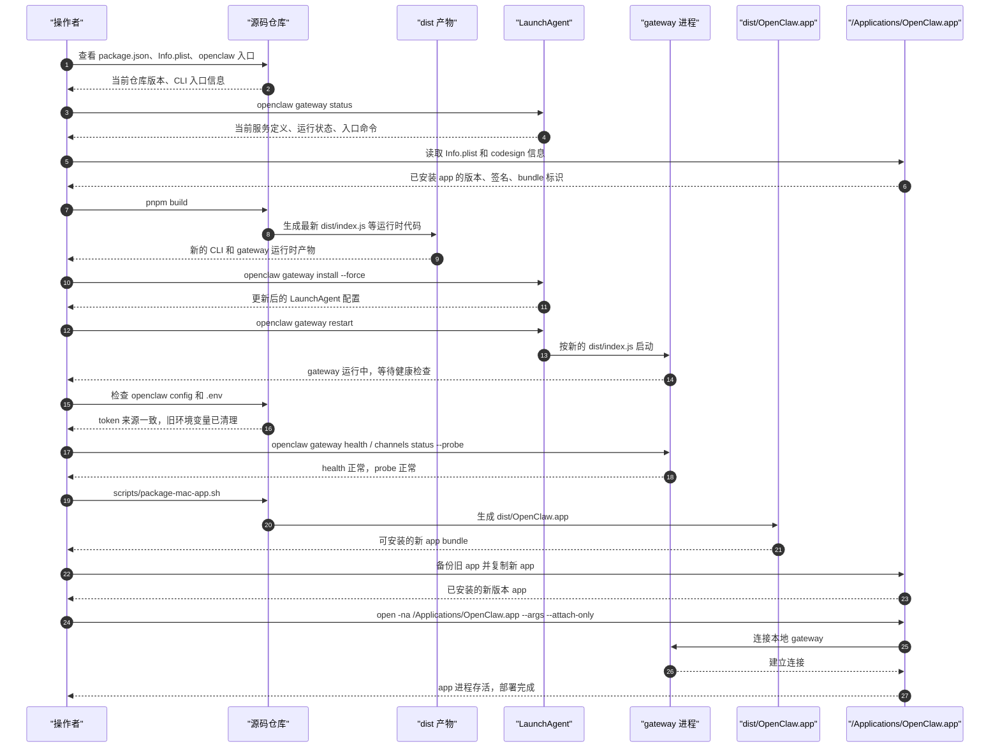

# macOS 源码部署复盘

这是一份基于一次真实操作过程整理出来的详细复盘文档，目标是把下面几件事情讲清楚：

- 仓库代码更新以后，怎么判断本地到底哪些部分已经更新，哪些还没有更新
- 怎么从源码重新构建 OpenClaw 的 CLI 和 gateway 运行时
- 怎么刷新 macOS 上的 gateway 托管服务
- 怎么从源码重新打包原生 macOS app
- 怎么把新 app 部署到 `/Applications/OpenClaw.app`
- 怎么做最终验收，确认 CLI、gateway 和 app 都已经切换到最新版本

这份文档面向对整个部署流程还不熟悉的操作者。它不会只给结果，也会解释每个环节为什么要这样做、中间为什么会卡住、以及最后是怎么排掉问题的。

相关文档：

- [/platforms/mac/dev-setup](/platforms/mac/dev-setup)
- [/platforms/mac/signing](/platforms/mac/signing)
- [/cli/gateway](/cli/gateway)
- [/help/troubleshooting](/help/troubleshooting)

## 一次完整部署到底在更新什么

在 macOS 上说“OpenClaw 已经更新了”，实际上可能指的是三件不同的事情：

1. `openclaw` 这个 CLI 命令已经指向最新的本地源码。
2. 后台的 gateway 托管服务已经在运行最新的本地构建产物。
3. `/Applications/OpenClaw.app` 这个原生桌面 app 也已经被替换成最新版本。

这三件事不能混为一谈，必须分别确认。

在这次部署里，我们最终想达到的状态是：

- CLI 版本和仓库版本一致
- LaunchAgent 启动的 gateway 服务运行的是仓库里刚构建出来的 `dist/index.js`
- 安装在 `/Applications` 里的 app 版本和仓库版本一致
- `openclaw gateway health` 和 `openclaw channels status --probe` 这类校验命令可以正常工作，不再被陈旧 token 干扰

## 这次部署的主流程概览

这次工作最后自然分成了下面几个阶段：

1. 先搞清楚当前真实状态
2. 重新构建本地源码产物
3. 刷新 gateway 托管服务
4. 排查并修复 token 漂移问题
5. 从源码打包 macOS 原生 app
6. 替换系统里已安装的 app
7. 对 CLI、gateway 和 app 做最终验收

## 从源码到部署完成的命令顺序

如果你下次要从头再走一次，本节可以当成“按顺序执行的操作手册”来看。

这里有两个前提需要先说明：

- 下面的命令默认你已经在仓库根目录
- 这些命令面向“本地源码部署到当前这台 Mac”，不是做正式发布包

### 第 0 步：确认仓库版本和当前命令入口

先确认你现在看到的版本到底来自哪里，避免后面一直在调错对象。

```bash
sed -n '1,80p' package.json
which openclaw
ls -l ~/.local/bin/openclaw
openclaw --version
```

这组命令分别在做什么：

- `sed -n '1,80p' package.json`：看仓库当前声明的版本号
- `which openclaw`：确认终端实际调用的是哪一个 `openclaw`
- `ls -l ~/.local/bin/openclaw`：确认这个入口是不是软链接到当前仓库
- `openclaw --version`：确认 CLI 实际跑起来的版本

这一步的产出：

- 你知道仓库“目标版本”是什么
- 你知道 CLI 当前是否已经指向本地仓库

### 第 1 步：检查现有 gateway 和 app 的实际状态

先看后台服务和系统里安装的 app 是不是已经同步，不要先入为主。

```bash
openclaw gateway status
lsof -nP -iTCP:18789 -sTCP:LISTEN
defaults read /Applications/OpenClaw.app/Contents/Info CFBundleShortVersionString
codesign -dv --verbose=2 /Applications/OpenClaw.app 2>&1 | sed -n '1,20p'
```

这组命令分别在做什么：

- `openclaw gateway status`：看 LaunchAgent 是否加载、gateway 是否运行、当前入口命令是什么
- `lsof -nP -iTCP:18789 -sTCP:LISTEN`：确认本机是否真有进程在监听 gateway 端口
- `defaults read ... CFBundleShortVersionString`：看当前安装 app 的版本
- `codesign -dv --verbose=2 ...`：看 app 的签名类型和 bundle 标识

这一步的产出：

- 你知道 gateway 现在是不是在跑
- 你知道 app 现在是不是旧版本
- 你知道当前 app 是正式签名还是本地 ad-hoc 签名

### 第 2 步：从源码重新构建 CLI 和 gateway 运行时

源码更新以后，真正让 gateway 和 CLI 可运行的是 `dist/` 里的构建产物，而不是 `src/` 本身。

```bash
pnpm build
```

这条命令在做什么：

- 编译 TypeScript 和相关产物
- 重新生成 `dist/index.js` 等运行时代码

这一步的产出：

- 最新的 `dist/` 构建结果
- 后续 gateway 服务要切换到的新运行时

### 第 3 步：刷新 gateway 的托管服务定义

只构建还不够，还要让 macOS 上托管 gateway 的服务重新对齐到新的构建结果和配置。

```bash
openclaw gateway install --force
openclaw gateway restart
openclaw gateway status
```

这组命令分别在做什么：

- `openclaw gateway install --force`：重写 LaunchAgent 配置，把服务定义刷新到当前仓库状态
- `openclaw gateway restart`：重启服务，让新的定义和新的 `dist/` 生效
- `openclaw gateway status`：立即检查服务是否真的起来了

这一步的产出：

- 更新后的 LaunchAgent 配置
- 指向当前 `dist/index.js` 的 gateway 进程
- 一份可用于验收的运行状态

### 第 4 步：检查并修正 gateway token 配置

如果 `status` 正常，但 `health` 或 `probe` 还在报 token mismatch，就说明不是简单的“服务没起来”，而是鉴权配置漂移了。

```bash
openclaw config get gateway.auth.token
openclaw config get gateway.remote.token
openclaw gateway health
openclaw channels status --probe
rg -n 'OPENCLAW_GATEWAY_TOKEN|OPENCLAW_GATEWAY_PASSWORD' .env .env.*
```

这组命令分别在做什么：

- 前两条：检查本地配置文件里的 token 是否一致
- `openclaw gateway health`：直接验证 CLI 到 gateway 的健康检查
- `openclaw channels status --probe`：验证实际探测路径是否能通过鉴权
- `rg -n ... .env .env.*`：检查仓库根目录有没有旧环境变量偷偷覆盖配置

如果你确认 `.env` 里有旧的 `OPENCLAW_GATEWAY_TOKEN`，就需要把它删掉，然后重新验证：

```bash
openclaw gateway health
openclaw channels status --probe
```

这一步的产出：

- 一致的 gateway token 来源
- 正常返回的 health 和 probe 结果

### 第 5 步：从源码打包 macOS 原生 app

更新 gateway 以后，桌面 app 不会自动跟着变新，它必须单独重新打包。

```bash
SIGN_IDENTITY="-" \
DISABLE_LIBRARY_VALIDATION=1 \
SKIP_TEAM_ID_CHECK=1 \
BUNDLE_ID=ai.openclaw.mac \
APP_VERSION=<当前仓库版本> \
SKIP_TSC=1 \
scripts/package-mac-app.sh
```

这组参数分别在做什么：

- `SIGN_IDENTITY="-"`：用 ad-hoc 方式签名，适合本机没有 Apple 证书的情况
- `DISABLE_LIBRARY_VALIDATION=1`：减少本地开发签名时的动态库校验摩擦
- `SKIP_TEAM_ID_CHECK=1`：跳过 Team ID 检查，适配 ad-hoc 签名
- `BUNDLE_ID=ai.openclaw.mac`：保持和当前安装 app 一致的 bundle 标识
- `APP_VERSION=<当前仓库版本>`：把打包出来的 app 版本设成当前仓库版本
- `SKIP_TSC=1`：前面已经 `pnpm build` 过了，这里不重复做 JS 构建

这一步的产出：

- `dist/OpenClaw.app`
- 一份可以本机安装的新版原生 app bundle

### 第 6 步：备份旧 app 并安装新 app

系统级替换前一定先备份，避免新 app 启动异常时没有退路。

```bash
backup="/Applications/OpenClaw.app.backup-$(date +%Y%m%d-%H%M%S)"
mv /Applications/OpenClaw.app "$backup"
ditto dist/OpenClaw.app /Applications/OpenClaw.app
/usr/libexec/PlistBuddy -c 'Print :CFBundleShortVersionString' /Applications/OpenClaw.app/Contents/Info.plist
codesign -dv --verbose=2 /Applications/OpenClaw.app 2>&1 | sed -n '1,20p'
```

这组命令分别在做什么：

- 第一条：生成带时间戳的备份路径
- 第二条：把旧 app 移走，保留回滚入口
- 第三条：把新 app 复制到 `/Applications`
- 第四条：确认安装后的版本号
- 第五条：确认安装后的签名和 bundle 信息

这一步的产出：

- 一份旧 app 备份
- 已安装到系统目录的新 app

### 第 7 步：启动 app 并做端到端验收

安装完成以后，还要确认 app 真能启动、gateway 真能连接、probe 真能通过。

```bash
open -na /Applications/OpenClaw.app --args --attach-only
pgrep -af '/Applications/OpenClaw.app/Contents/MacOS/OpenClaw'
openclaw --version
openclaw gateway status
openclaw gateway health
openclaw channels status --probe
```

这组命令分别在做什么：

- `open -na ... --attach-only`：启动新 app，并以附着模式连接现有 gateway
- `pgrep -af ...`：确认 app 进程真的在运行
- 后面四条：分别验证 CLI、gateway、health、channel probe

这一步的产出：

- 正在运行的新 app 进程
- 一套完整的部署验收结果

### 第 8 步：如果失败，按最短路径回滚

如果新 app 有问题，最短回滚路径是先恢复 app，再继续排查 gateway。

```bash
rm -rf /Applications/OpenClaw.app
mv /Applications/OpenClaw.app.backup-<timestamp> /Applications/OpenClaw.app
open -na /Applications/OpenClaw.app
```

如果是 gateway 鉴权异常没有恢复，则优先重新检查：

```bash
openclaw config get gateway.auth.token
openclaw config get gateway.remote.token
rg -n 'OPENCLAW_GATEWAY_TOKEN|OPENCLAW_GATEWAY_PASSWORD' .env .env.*
openclaw gateway install --force
openclaw gateway restart
```

## 部署时序图

下面这张图把“谁在产出什么”串起来了。它不是代码调用图，而是一次人工部署操作的时序图。



### 这张图里每个阶段的主要产出

- 仓库检查阶段：确认目标版本、CLI 实际入口、当前 app 状态
- 构建阶段：生成新的 `dist/index.js` 和其他运行时代码
- 服务刷新阶段：生成更新后的 LaunchAgent 定义，并拉起新的 gateway 进程
- 鉴权修正阶段：清理旧 token 干扰，恢复健康检查和 probe
- app 打包阶段：生成 `dist/OpenClaw.app`
- app 安装阶段：产出备份旧 app 和新的 `/Applications/OpenClaw.app`
- 最终验收阶段：产出一组可重复执行的健康检查结果

下面按阶段详细展开。

## 第一阶段：先搞清楚当前真实状态

刚开始最重要的事情不是“立刻构建”，而是先避免误判。

我们需要先回答几个问题：

- 仓库本身声明的版本号是多少
- 当前终端里执行的 `openclaw` 版本是多少
- 这个 `openclaw` 到底来自 npm 全局安装，还是来自当前仓库
- `/Applications/OpenClaw.app` 的版本是多少
- 后台 gateway 服务现在实际跑的入口文件是什么

### 这一阶段做了什么

我们先看版本相关文件和实际入口：

```bash
sed -n '1,120p' package.json
rg -n '"version"|CFBundleShortVersionString|versionName' \
  package.json apps/android/app/build.gradle.kts \
  apps/ios/Sources/Info.plist \
  apps/macos/Sources/OpenClaw/Resources/Info.plist
which openclaw
openclaw --version
ls -l ~/.local/bin/openclaw
defaults read /Applications/OpenClaw.app/Contents/Info CFBundleShortVersionString
openclaw gateway status
```

### 这一阶段得到的结论

结论非常关键：

- 仓库版本已经是新版本
- `openclaw --version` 返回的 CLI 版本也是新版本
- `~/.local/bin/openclaw` 实际上是一个软链接，指向当前仓库里的 `openclaw.mjs`
- gateway 服务已经是从当前仓库的构建产物启动
- 但是 `/Applications/OpenClaw.app` 仍然是旧版本

这意味着问题并不是“CLI 还没更新”，而是更细一点：

- CLI 这一层基本已经是新的
- gateway 服务需要确认它的运行时和服务定义是否真的同步
- 原生 app 确实还需要单独更新

### 这一阶段最容易踩的坑

最容易犯的错是：

- 看到 `openclaw --version` 已经是新版本，就以为整套本地部署都已经更新完了

这是不对的，因为：

- app bundle 可能还是旧的
- LaunchAgent 的服务元数据可能还是旧的
- gateway 服务可能虽然“在跑”，但跑的是旧配置或者旧鉴权状态

所以只看 CLI 版本远远不够。

## 第二阶段：重新构建本地源码产物

既然本地 `openclaw` 命令已经直接指向当前仓库，那么接下来最合理的动作就是重建仓库产物。

### 这一阶段做了什么

执行：

```bash
pnpm build
```

这个命令会重新生成 TypeScript 产物，也就是 `dist/` 下面那一批真正被 CLI 和 gateway 服务使用的运行时代码。

### 为什么必须做这一步

很多人容易有一个误区：

- “代码已经 `git pull` 了，服务就算更新了”

对这套部署方式来说，这个理解不成立。

原因是 gateway 服务不是直接解释 `src/` 里的源码，而是跑构建后的 `dist/index.js`。

所以只更新源码并没有用，必须重新构建：

- 源码更新
- `pnpm build`
- 才能让服务运行的产物更新

### 怎么判断这一步成功

这一步成功的标准是：

- `pnpm build` 完成
- `openclaw --version` 仍然是当前仓库版本
- `dist/` 已经被重新生成

### 这一阶段的卡点

这一步本身没有遇到严重构建失败，但它有一个概念上的卡点：

- 很多人会以为“源码已经是最新”就等于“服务已经是最新”

这次复盘里要反复强调：

- 如果 LaunchAgent 跑的是 `dist/index.js`
- 那么“构建”就是部署链路里不可跳过的一步

## 第三阶段：刷新 gateway 托管服务

重新构建以后，下一步不是立刻去碰 app，而是先刷新 macOS 上托管 gateway 的服务定义。

### 为什么这一阶段必须单独做

即使仓库已经构建完成，LaunchAgent 仍然可能保留旧信息，比如：

- 旧的版本元数据
- 旧的 token 环境
- 旧的启动参数

也就是说，光有新 `dist/` 还不够，必须让服务定义重新对齐。

### 这一阶段做了什么

先看 LaunchAgent 和服务状态：

```bash
plutil -p ~/Library/LaunchAgents/ai.openclaw.gateway.plist
openclaw gateway status
lsof -nP -iTCP:18789 -sTCP:LISTEN
```

然后刷新服务定义并重启：

```bash
openclaw gateway install --force
openclaw gateway restart
```

### 为什么不是只执行 restart

因为 `restart` 只是把现有服务重新拉起来。

而 `install --force` 做的事情更多：

- 重写 LaunchAgent plist
- 刷新服务元数据
- 更新服务环境
- 让托管服务和当前配置重新对齐

这在处理版本漂移、token 漂移时尤其重要。

### 这一阶段我们观察到了什么

服务在“表面上”其实一直能跑，但 LaunchAgent 里的一些元数据仍然显示旧信息。

也就是说：

- 服务不是完全坏的
- 但它也不能算完全干净

这个状态很危险，因为会让人误以为“没问题”，实际上后面会在 probe、auth、channel 状态上反复出怪问题。

### 这一阶段的成功标准

`openclaw gateway status` 应该能看到：

- `Service: LaunchAgent (loaded)`
- 启动命令指向当前仓库构建产物
- `Runtime: running`
- `RPC probe: ok`

### 这一阶段最容易踩的坑

最容易踩的坑是：

- 服务已经在跑，所以以为不需要重新 install

这次实际经验说明，如果你做的是源码部署更新，最好把下面两步当成固定动作：

```bash
openclaw gateway install --force
openclaw gateway restart
```

## 第四阶段：排查并修复 token 漂移

这是整个部署过程中最难发现、也最容易让人怀疑人生的环节。

当时出现的现象是：

- 配置文件里 token 是新的
- gateway 服务已经重装并重启
- 显式传 `--token` 的命令可以成功
- 但是不带显式 token 的 `openclaw gateway health`、`openclaw channels status --probe` 还是在报 token mismatch

这说明系统处于一种“半更新成功”的状态。

### 先出现了哪些异常

最明显的两个异常是：

- `openclaw gateway health` 只有在显式传 token 时才能成功
- `openclaw channels status --probe` 报 gateway token mismatch

这类问题很迷惑，因为你会直觉怀疑：

- 是不是服务没重启
- 是不是配置没写进去
- 是不是 app 还在拿旧 token

但这些直觉都只对了一部分。

### 第一次修正：把 remote token 和 auth token 对齐

我们先检查：

```bash
openclaw config get gateway.auth.token
openclaw config get gateway.remote.token
```

然后把 `gateway.remote.token` 和 `gateway.auth.token` 对齐。

这一步是必要的，因为有些 probe 路径会读 remote token。

但是，做完之后问题仍然没有完全消失。

### 第二次怀疑：是不是服务里还有旧 token

于是我们继续：

- 重看 LaunchAgent plist
- 再次重启服务

但结果是：

- 显式 token 仍然有效
- 无参 probe 仍然偶发失败

说明问题不只是“服务没刷新”。

### 最终定位到的真正根因

真正的问题在仓库根目录的 `.env` 文件。

这个 `.env` 里还残留了一条旧的：

```bash
OPENCLAW_GATEWAY_TOKEN=...
```

而 OpenClaw 读配置的时候，会自动加载 repo 根目录 `.env`。

于是就发生了一个非常隐蔽的问题：

- `~/.openclaw/openclaw.json` 里明明已经是新 token
- 但 CLI 在解析 gateway 鉴权时，又从 `.env` 里读到了旧 token
- 结果最终实际拿去连接 gateway 的仍然是旧 token

### 为什么这个问题特别难发现

因为从表面上看，很多东西都是“对的”：

- 配置文件是对的
- gateway 服务是新的
- CLI 版本是新的

但是配置加载时，进程环境被 repo 根目录 `.env` 污染了。

最迷惑的一点是：

- 在 `loadConfig()` 之前，`process.env.OPENCLAW_GATEWAY_TOKEN` 是空的
- 调用 `loadConfig()` 之后，进程里突然冒出旧 token

如果不继续追，就很容易误判成：

- “是不是 OpenClaw 内部有个缓存”

实际上不是缓存，而是 `.env` 自动注入。

### 我们最后怎么解决的

直接删除仓库根目录 `.env` 里的旧：

- `OPENCLAW_GATEWAY_TOKEN`

删除之后再次验证：

```bash
openclaw gateway health
openclaw channels status --probe
```

两者都恢复正常。

### 这一阶段的最大经验

如果你以后遇到下面这种情况：

- 配置文件里 token 是新的
- 服务已经重启
- 但是 probe 还是像拿了旧 token 一样失败

一定要检查：

```bash
rg -n 'OPENCLAW_GATEWAY_TOKEN|OPENCLAW_GATEWAY_PASSWORD' .env .env.*
```

对于源码部署，这一步非常重要。

## 第五阶段：在替换 app 之前先审视当前已安装 app

在动 `/Applications/OpenClaw.app` 之前，我们先确认系统里现在装的 app 是什么状态。

### 这一阶段做了什么

检查当前已安装 app：

```bash
defaults read /Applications/OpenClaw.app/Contents/Info CFBundleShortVersionString
codesign -dv --verbose=4 /Applications/OpenClaw.app 2>&1 | sed -n '1,40p'
```

### 这一阶段得到的结论

系统里的 app 是旧版本，而且是标准的 Developer ID 签名、已公证的构建产物。

这一点非常重要，因为本机当时没有可用的 Apple 签名证书。

所以后面虽然我们可以从源码打出新版 app，但无法在本机复刻“官方发布包”的签名形态。

换句话说：

- 我们能更新到最新源码版本
- 但本地生成的是开发用的 ad-hoc 签名包
- 不是官方那种 Developer ID notarized 包

## 第六阶段：从源码打包原生 macOS app

确认完现有 app 以后，就进入了原生 app 打包阶段。

### 这一阶段为什么不能省

前面已经验证过：

- gateway 更新了，不代表 `/Applications/OpenClaw.app` 也更新了

app 是单独的一套 bundle，必须显式打包和替换。

### 这一阶段做了什么

我们走的是本地开发签名路径：

```bash
SIGN_IDENTITY="-" \
DISABLE_LIBRARY_VALIDATION=1 \
SKIP_TEAM_ID_CHECK=1 \
BUNDLE_ID=ai.openclaw.mac \
APP_VERSION=<当前仓库版本> \
SKIP_TSC=1 \
scripts/package-mac-app.sh
```

### 这些参数为什么要这样设置

这几个参数不是随便加的，每个都有原因：

- `SIGN_IDENTITY="-"`：因为本机没有可用 Apple 签名证书，只能用 ad-hoc 签名
- `DISABLE_LIBRARY_VALIDATION=1`：本地开发构建时减少 Sparkle 和嵌入 framework 的校验摩擦
- `SKIP_TEAM_ID_CHECK=1`：ad-hoc 签名没有 Team ID，跳过 Team ID 审计
- `BUNDLE_ID=ai.openclaw.mac`：保持和现有安装 app 一致的 bundle 标识
- `SKIP_TSC=1`：前面已经做过 `pnpm build`，这里不再重复做 JS 构建

### 这个打包脚本到底做了什么

`scripts/package-mac-app.sh` 实际上做了不少事情：

- 确保依赖存在
- 构建 control UI
- 编译 Swift 原生 app
- 组装 `dist/OpenClaw.app`
- 拷贝资源和 framework
- 做签名

### 这一阶段遇到的卡点

最大的卡点不是“打不出来”，而是“签名形态和正式发布不同”。

由于没有 Apple 证书，所以最终结果是：

- 可以用
- 版本是对的
- app bundle 也完整
- 但签名是 ad-hoc

这会带来一个后续影响：

- macOS 可能把它当成新签名的 app
- 某些权限可能需要重新授予

这一点不是部署失败，而是本地源码部署的正常副作用。

## 第七阶段：安全替换系统里的 app

新 app 打包完成以后，我们没有直接粗暴覆盖，而是先备份旧 app，再安装新 app。

### 这一阶段做了什么

大致动作是：

```bash
backup="/Applications/OpenClaw.app.backup-<timestamp>"
mv /Applications/OpenClaw.app "$backup"
ditto dist/OpenClaw.app /Applications/OpenClaw.app
```

### 为什么一定要先备份

因为替换 `/Applications/OpenClaw.app` 属于高影响动作。

备份的价值在于：

- 如果新 app 起不来，可以立刻回滚
- 如果后面发现权限、签名、Sparkle 相关行为异常，可以对比旧 bundle
- 可以避免“覆盖后才发现没有退路”

### 替换后马上做了哪些检查

我们先检查安装后的 bundle：

```bash
/usr/libexec/PlistBuddy -c 'Print :CFBundleShortVersionString' /Applications/OpenClaw.app/Contents/Info.plist
codesign -dv --verbose=2 /Applications/OpenClaw.app 2>&1 | sed -n '1,20p'
```

我们想看到的结果是：

- 版本号已经变成当前仓库版本
- bundle identifier 正确
- 签名存在，即使它是 ad-hoc

## 第八阶段：启动并验证新 app

复制完成以后，还不能算部署完成，必须验证新 app 真的能运行。

### 这一阶段做了什么

启动 app 并检查进程：

```bash
open -na /Applications/OpenClaw.app --args --attach-only
pgrep -af '/Applications/OpenClaw.app/Contents/MacOS/OpenClaw'
```

### 中间出现了什么现象

app 启动初期的日志里短暂出现了连接失败：

- connection refused
- gateway ws connect failed

表面看起来像是 app 起不来。

但继续看之后发现：

- app 进程其实已经活着
- 它只是启动时尝试连接 gateway 的那个瞬间，gateway 还没完全就绪

这属于启动时序上的暂时性现象，不是 app bundle 损坏。

### 我们怎么判断最终是成功的

最后确认成功的依据是：

- app 进程持续存在，没有立刻退出
- app bundle 的版本已经变成当前仓库版本
- 后续 gateway 和 channel probe 都恢复健康

## 最终验收时我们是怎么确认整套部署完成的

部署结束以后，我们对三类对象分别做了核对。

### 1. 验证 CLI

执行：

```bash
openclaw --version
```

预期：

- 返回的版本号和 `package.json` 一致

### 2. 验证 gateway 服务

执行：

```bash
openclaw gateway status
```

预期：

- `Service: LaunchAgent (loaded)`
- 启动命令指向当前仓库构建产物
- `Runtime: running`
- `RPC probe: ok`

### 3. 验证 channel probe

执行：

```bash
openclaw channels status --probe
```

预期：

- `Gateway reachable`
- 已配置 channel 正常显示可用状态

### 4. 验证 app

执行：

```bash
/usr/libexec/PlistBuddy -c 'Print :CFBundleShortVersionString' /Applications/OpenClaw.app/Contents/Info.plist
pgrep -af '/Applications/OpenClaw.app/Contents/MacOS/OpenClaw'
```

预期：

- 版本号和仓库一致
- app 进程在运行

## 最终到底哪些东西被更新了

在这次部署结束时，下面这些对象都已经切换到当前本地源码：

- CLI：已经是当前仓库版本，并且命令入口指向仓库
- 本地运行时：`dist/` 已重新构建
- gateway 托管服务：已经刷新，运行的是当前仓库构建产物
- `/Applications/OpenClaw.app`：已经替换为当前仓库打包出来的新 app

## 这次部署完成后仍然存在的限制

虽然从“版本一致”和“部署完成”的角度看，这次已经成功，但还是有几个需要知道的限制。

### 1. app 不是 Developer ID 正式签名包

这是本地源码构建的自然结果。

也就是说：

- 版本是最新的
- 功能上可以运行
- 但它不是官方发布的 notarized app

### 2. macOS 权限可能需要重新授予

由于这次 app 是 ad-hoc 签名，本机可能会重新判断它的权限身份。

受影响的权限可能包括：

- 麦克风
- 相机
- 辅助功能
- 自动化控制

如果后面发现某些权限行为不稳定，可以再结合：

- [/platforms/mac/dev-setup](/platforms/mac/dev-setup)
- [/platforms/mac/signing](/platforms/mac/signing)

继续处理。

### 3. gateway 服务当前使用的是版本管理器里的 Node

`openclaw gateway status` 最后仍然会提示：

- LaunchAgent 现在用的是 nvm 里的 Node 路径

这不会阻止当前部署成功，但它是一个运营层面的脆弱点：

- 如果后面切换了 Node 版本
- 或者 nvm 路径变化
- 服务可能以后会断

它不是当前部署失败，只是后续值得继续收尾的一个点。

## 这次部署里最重要的经验总结

### 经验一：一定要把 CLI、gateway、app 分开验证

不要再把下面这句话当成判断标准：

- “`openclaw --version` 已经是新的，所以全都更新完了”

正确做法是分别确认：

- CLI 是不是新的
- gateway 服务是不是新的
- `/Applications/OpenClaw.app` 是不是新的

### 经验二：源码部署时，repo 根目录 `.env` 非常容易成为隐藏变量

如果你遇到：

- 配置文件看起来是对的
- 服务也重启过了
- 但 probe 还是像在拿旧 token

请优先检查：

- `~/.openclaw/openclaw.json`
- repo 根目录 `.env`
- LaunchAgent plist

### 经验三：源码部署里，重新 install 服务是标准动作

以后更新本地源码时，建议把下面两步视为固定动作：

```bash
openclaw gateway install --force
openclaw gateway restart
```

### 经验四：更新 gateway 和更新原生 app 是两条不同的链路

即使 gateway 已经切到了新版本，也不代表 `/Applications/OpenClaw.app` 同步更新了。

更新 app 必须单独：

- 打包
- 备份旧 app
- 替换新 app
- 启动验证

## 下次重复部署时建议按这个顺序做

如果以后还要重复一次同样的本地源码部署，建议按下面顺序：

1. 拉取最新源码
2. 确认仓库版本和 CLI 版本
3. 执行 `pnpm build`
4. 执行 `openclaw gateway install --force`
5. 执行 `openclaw gateway restart`
6. 验证 `openclaw gateway status`
7. 验证 `openclaw channels status --probe`
8. 构建 `dist/OpenClaw.app`
9. 备份 `/Applications/OpenClaw.app`
10. 把新 app 复制到 `/Applications`
11. 启动 app
12. 再次检查版本、进程和 gateway 健康状态

## 如果需要回滚，应该怎么做

如果新 app 替换以后出现严重问题，可以这样回滚：

1. 退出当前新 app
2. 删除 `/Applications/OpenClaw.app`
3. 恢复备份：

   ```bash
   mv /Applications/OpenClaw.app.backup-<timestamp> /Applications/OpenClaw.app
   ```

4. 重新启动旧 app

如果 gateway 在源码更新后出现鉴权异常，则优先回看：

1. `~/.openclaw/openclaw.json`
2. repo 根目录 `.env`
3. `~/Library/LaunchAgents/ai.openclaw.gateway.plist`
4. 然后重新 install 服务

## 最后的简短结论

这次部署最后之所以能成功，不是因为某一个命令特别关键，而是因为我们把看上去像一个问题的事情拆成了三层：

- 运行时代码重建
- gateway 托管服务刷新
- 原生 app 重新打包和替换

这次最难的卡点并不是编译失败，而是配置漂移：

- 配置文件里明明已经是新 token
- 但 repo 根目录 `.env` 里的旧 token 又在配置加载时被自动注入进来
- 于是 probe 一直像在用旧 token

这个问题一旦不搞清楚，就会让人反复怀疑服务、怀疑缓存、怀疑 app。

真正清理掉 `.env` 以后，gateway health、channel probe 和 app 部署才终于全部回到一致状态。
